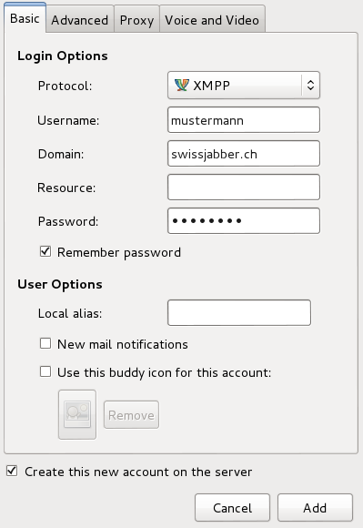

# Was ist swissjabber?

Swissjabber ist eine von [nine.ch](http://nine.ch) betriebene, öffentliche Chatplattform.


# Wie erstelle ich einen Account?

## Allgemein

Wenn du noch nicht bei Swissjabber registriert bist, musst du dir einen
Nicknamen auswählen. Dieser bildet zusammen mit der Domain deine
```Jabber-ID```. Unter dieser bist du in Zukunft im Jabber-Netzwerk
bekannt. Eine ```Jabber-ID``` (Jabber-Identifikation kurz: ```jid``` oder ```jabber-id```)
sieht aus wie eine E-Mailadresse (zum Beispiel: ```mustermann@swissjabber.ch```).

Aus folgenden Domains kannst du wählen:

* swissjabber.ch
* swissjabber.li
* swissjabber.org
* swissjabber.de
* swissjabber.eu


## Account erstellen



Es gibt Clients welche es erlauben, direkt auf dem Server einen Account
anzulegen. Unglücklicherweise unterstützen nicht alle Clients (z.B Empathy)
diese sogenannte Inband-Registration nicht.

Bei den meisten Client läuft das Einrichten eines Account ungefähr
gleich ab. Normalerweise muss dazu die komplette ```jid``` und ein Passwort
angegeben werden. In einigen Fällen (wie bei Pidgin) müssen Nickname und
Domain getrennt angegeben werden.

Falls du also schon einen Account registriert hast, dich jedoch nicht
am Swissjabber-Server anmelden kannst, probiere beide Varianten bei deinem Client aus.

Wird die Inband-Registration vom Client unterstützt, so müssen die Daten
wie beim Einrichten eines Accounts eingegeben werden. Zusätzlich muss
jedoch noch der Punkt "Create this new account..." (oder ähnlich, je
nach Client) angekreuzt werden. Damit wird ein neuer Account auf dem
Swissjabber-Server angelegt.


# FAQ

## Wie kann ich mein funktionierendes Passwort ändern?

Das Passwort kann über die entsprechende Funktion in deinem Jabber-Client
geändert werden. Sollte dein Jabber-Client diese Funktion nicht unterstützen,
versuche es mit einem anderen Client. [Pidgin](http://pidgin.im/) unterstützt
dieses Feature.


## Wieso kann ich mich seit der Migration nicht mehr anmelden?

Wie vor der Migration angekündigt, wurden nur Accounts auf den neuen Server
migriert, welche eine Mailadresse eingetragen und auch die AGBs akzeptiert
hatten.

Wenn das Anmelden nun nicht mehr funktioniert, ist ein Mail an
[support@nine.ch](mailto:support@nine.ch) nötig, damit wir den Account
manuell auf den neuen Server migrieren können.


## Wieso sehen mich einige Kontakte nicht mehr online?

Seit der Migration auf den neuen Server existieren zu anderen Jabber-Servern
noch Verbindungsprobleme. Explizit bekannt sind uns derzeit:

* jabber.ru
* jaim.at

Bitte an [support@nine.ch](mailto:support@nine.ch) eine kurze Nachricht senden,
wenn solche Probleme auch mit anderen Anbietern auftreten.

## Wieso kann ich mich von Server X nicht mit Swissjabber verbinden.

Seit 28.10.2014 lassen wir keine unverschlüsselten Verbindungen auf Swissjabber mehr zu.
Falls Sie keine Chats mehr mit Swissjabber Accounts führen können deutet dies darauf hin,
dass Ihr verwendeter Jabber Server keine Transport Verschlüsselung unterstützt.
